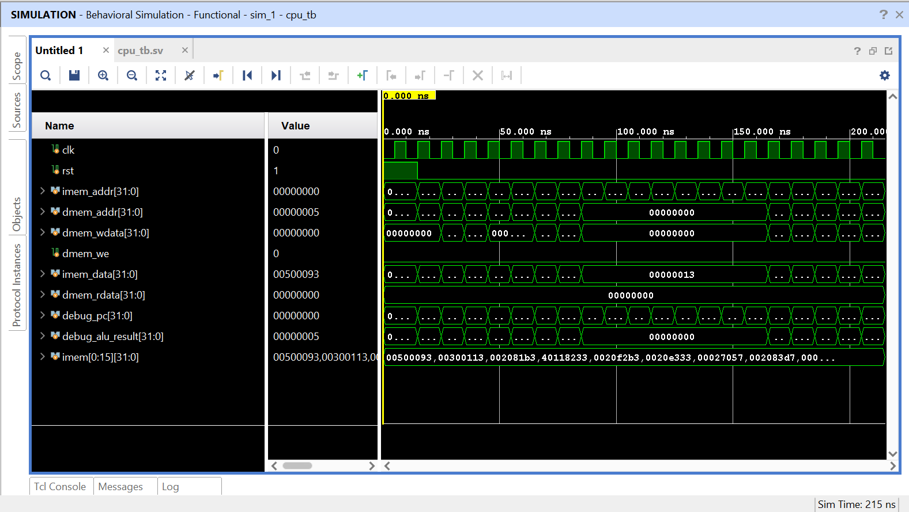

# VORTEX-1 CPU

A custom 32-bit RISC-V (RV32I) CPU implemented in SystemVerilog.

## Unique Feature
Runtime-configurable SIMD vector unit with 1, 2, or 4 active lanes,
controlled via a custom `VCFG` CSR instruction. Software can tune
parallelism at runtime without recompiling hardware.

## Files
- `src/alu.sv` — Arithmetic Logic Unit
- `src/register_file.sv` — 32x32-bit register file
- `src/vector_unit.sv` — Configurable vector execution unit
- `src/cpu_core.sv` — 5-stage pipeline core
- `tb/cpu_tb.sv` — Testbench

## Simulation
Tested in Vivado 2025.1 behavioral simulation.

